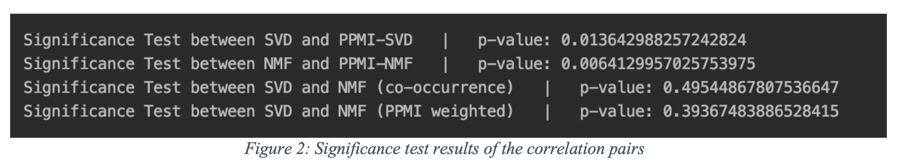

# Word-Association

In this assignment, we are expected to implement multiple dimensionality reduction algorithms with and
without using a weighting function and compare the results. To be able to compare the results, we need
to calculate correlation between human judgements and word similarities. Also, we need to apply
statistical significance test between the correlations to prove the experimental result.

## 1. Implementation

I used pre-generated matrix file to load the corpus. After that, I applied the PPMI (Positive Pointwise
Mutual Information) weighting to it. I used both SVD and NMF dimensionality reduction algorithms to
reduce the dimensions of the matrix.

I implemented combinations of algorithms as follows:
* NMF with raw occurrence matrix
* NMF with PPMI weighted matrix
* SVD with raw occurrence matrix
* SVD with PPMI weighted matrix

## 2. Results

You can see the correlation results on the below figure, which clearly shows that; using PPMI weighting
gives better results with dimensionality reduction on the given corpus. We cannot sure about the
difference between NMF and SVD only by looking at the correlations, because they are close to each
other. Thus, we have to apply a statistical significance test on the correlations to find out whether the
difference between them occurred randomly or not.

I used Z-Test as a statistical significance test. First, I applied z-transformation on correlations by taking
inverse tangent (arctan(x)) of them. Then I applied the below formula to find z-value. After finding the
z-value, I looked up the z-table to find the corresponding p-value for it.

You can see the z-test results on the below figure.

**2.1. PPMI or Co-occurrence Counts?**

The first and second rows show the comparison between raw co-occurrence matrix and PPMI weighted
version of it. The both p-values are less than 0.05, which is our level of significance value. Thus, we
can say that the difference between the correlations are statistically significant and we cannot randomly
achieve these results with using raw co-occurrence counts. In other words, there is a significant
difference between raw co-occurrence counts and PPMI for our samples.

**2.2. SVD or NMF?**

The third and fourth rows show the comparison between SVD and NMF dimensionality reduction
algorithms. The both p-values are higher 0.05. Thus, we can say that the difference between the
correlations are not statistically significant and we can randomly achieve these results with using any of
two algorithms. In other words, there is no significant difference between SVD and NMF for our
samples.

# Installation

Python version:
`Python 3.6.5`

To install the requirements use the following command:
`pip3 install -r requirements.pip`

To run the code use the following command:
`python3 src/main.py`

